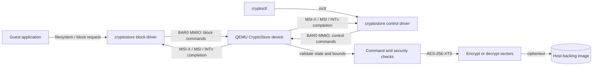
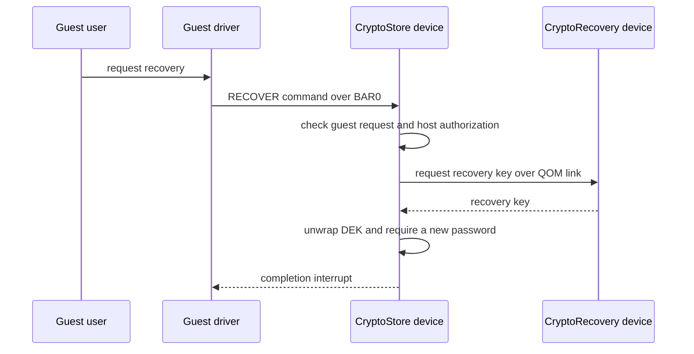

# PCIe CryptoStore

CryptoStore is an encrypted block device implemented as a QEMU PCIe device, with Linux guest drivers and a command-line tool. A guest sees a PCIe storage controller and a normal block device; QEMU owns the encryption keys, checks every command, and encrypts data before it reaches the backing image.

The project brings together a custom QEMU device, PCIe register interface, kernel block and control drivers, persistent image format, recovery device, and fault-injection defenses. It is built to make the security decisions reviewable: the threat model, device interface, evidence, and test outputs are in this repository.

## What the system does

- Stores sectors as AES-256-XTS ciphertext in a host-side image. The guest receives plaintext only while the device is unlocked.
- Wraps a random 512-bit data-encryption key (DEK) in password keyslots. PBKDF2-HMAC-SHA256 derives the wrapping key; the password itself is not stored.
- Persists failed attempts and applies backoff and lockout, so rebooting the VM does not reset the guessing limit.
- Wipes the in-memory key on lock, Function Level Reset (FLR), and detected faults. While locked, the driver reports a zero-capacity disk.
- Supports recovery through a separate QEMU recovery device. The storage device obtains the recovery key over an internal QOM link; the key is not sent through the guest.
- Rejects snapshots and migration so an image of VM memory cannot silently preserve an unlocked key.

## How a request reaches the encrypted image

The guest driver exposes a block device and a control device. It writes commands and parameters to BAR0 registers and windows. QEMU handles those MMIO accesses, performs the operation against the backing image, and signals completion with MSI-X (with MSI and INTx fallback). Sector requests are bounded to eight sectors per command. Password windows are write-only, are cleared after use, and are never included in trace values.



The device also has a recovery path that stays within QEMU:



## Fault-injection protection

The security checks are designed for the case where an attacker can glitch a real controller and skip or corrupt one instruction. QEMU cannot provide physical fault resistance; here, fault hooks, optimized-binary inspection, and a debugger-driven instruction-skip campaign exercise the design.

Drawing on my background in embedded security competitions, I've developed a defense mechanism using secure jitter to protect fault-susceptible instructions. When it comes to attack surface, many companies claim to be "hands-off" once a device has been physically acquired by an attacker but it helps both financially and reputationally to be prepared for what happens when someone captures a device while it's in a locked state.

The defenses focus on decisions where a single skipped check could change security: attempt counting and backoff, lock state, key wiping, KDF bounds, sector bounds, AES output, recovery release-once, and authentication-tag comparison. Checks are repeated in different forms, critical writes and wipes are verified, states use separated fail-secure encodings, and unexpected results take the device to fault handling, which wipes keys and locks the device.

The instruction-skip campaign found a real weakness in an early tag-verdict implementation: one skipped arithmetic instruction could turn a failed tag check into an accepted result. The verdict was redesigned so both independent comparisons are needed to produce the success value. The rerun reported no silent wrong outcomes. The same review also caught GCC merging two KDF-bound checks at `-O2`; one check was changed so the optimized code retains a distinct sequence.

Evidence and reproduction steps are in [Fault-injection evidence](docs/demo/fi-evidence.md). The broader assumptions and limits are in the [threat model](docs/threat-model.md).

## Build and run

The development path uses a Linux host with KVM, a custom QEMU build, and a Debian guest. The scripts build QEMU, prepare the guest image, and boot the VM:

```sh
scripts/build-qemu.sh
scripts/prepare-guest.sh
scripts/run-vm.sh
```

Inside the guest, the repository is available at `/mnt/host`:

```sh
cd /mnt/host
sudo make -C driver
sudo make -C tools
sudo insmod driver/cryptorecovery.ko
sudo insmod driver/cryptostore.ko
sudo tools/cryptoctl status
```

Use `tools/cryptoctl --help` for available commands. The CLI prompts for passwords without echoing them. For the guest driver and interrupt flow, see [driver-flow.md](docs/demo/driver-flow.md). For the register map and backing-file format, see the [datasheet](docs/cryptostore-datasheet.md).

## Review evidence

The repository includes captured evidence alongside the scripts that produce it:

| Evidence | What it demonstrates |
| --- | --- |
| [`docs/demo/evidence/attacker-view.txt`](docs/demo/evidence/attacker-view.txt) | What the backing image reveals without the password, including a ciphertext-sector inspection |
| [`docs/demo/evidence/fi-disasm-review.txt`](docs/demo/evidence/fi-disasm-review.txt) and `disasm-*.s` | The hardened checks remain in the optimized `-O2` output |
| [`docs/demo/evidence/fi-skip-campaign.txt`](docs/demo/evidence/fi-skip-campaign.txt) | Single-instruction skip campaign results, including the fixed tag-verdict issue |
| [`docs/demo/evidence/qtest-fault-samples.txt`](docs/demo/evidence/qtest-fault-samples.txt) | Representative injected-fault outcomes |

Reported results in the evidence index include 61/61 guest system checks, 8/8 crypto unit checks, 28/28 disassembly checks, and no silent outcome in the instruction-skip campaign. The index notes which full suites predate the final tag-verdict change; see [docs/demo/README.md](docs/demo/README.md) for that qualification and the complete status.

## Project map

| Area | Location |
| --- | --- |
| QEMU device models and crypto | `qemu/` |
| PCIe register definitions and interfaces | `include/` |
| Linux guest drivers | `driver/` |
| CLI, image tools, and evidence scripts | `tools/` |
| Threat model | [`docs/threat-model.md`](docs/threat-model.md) |
| Register and image format specification | [`docs/cryptostore-datasheet.md`](docs/cryptostore-datasheet.md) |
| Fault-injection evidence | [`docs/demo/fi-evidence.md`](docs/demo/fi-evidence.md) |

## Scope

This repository models a security-oriented device in QEMU. The fault-injection results are simulated and do not establish resistance of QEMU itself to a malicious host: host administrators can inspect QEMU memory. The protection claim concerns the backing image against an attacker who has the image but not the password or recovery key. See the [threat model](docs/threat-model.md) for the full trust assumptions and known limits.
