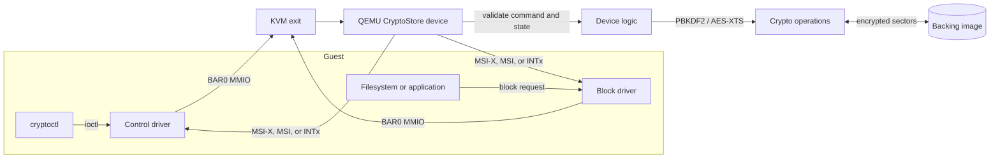

# How guest I/O reaches CryptoStore

CryptoStore is a QEMU PCIe device, so Linux discovers and drives it through the same PCI mechanisms used for a hardware endpoint. The guest writes registers and data windows in BAR0; QEMU handles those accesses and completes commands with an interrupt.

## The request path

1. **Enumeration.** Firmware and Linux find device ID `1af4:10f1` behind a PCIe root port. The PCI core assigns BAR0, the device's 8 KiB register and data window, and configures an interrupt (normally MSI-X).
2. **Driver binding.** `insmod cryptostore.ko` matches the PCI ID and calls `probe()`. The driver maps BAR0, checks the `CRST` magic value, enables bus mastering and MSI-X, and creates `/dev/cryptostore0` and `/dev/cryptostore-ctl0`.
3. **Commands.** For UNLOCK, `cryptoctl` passes the password through an ioctl. The driver writes it to the write-only password window, sets the command parameters, and rings the CMD doorbell. KVM routes the MMIO access to QEMU's device callback. The device persists the attempt before checking the password, runs PBKDF2 in a worker thread, and unwraps the DEK on success. It raises an interrupt when complete; the driver wakes the ioctl and reads the result. Password values are omitted from traces.
4. **Disk I/O.** A file read becomes a block request of up to eight sectors. The driver writes the LBA and count, then issues READ. QEMU reads ciphertext from the backing image, decrypts with AES-256-XTS using the sector number as the tweak, and verifies the output by re-encrypting it. Plaintext goes into the device data window for the driver to copy to the request; the driver then wipes its bounce buffer.
5. **Lock and reset.** Lock and FLR clear the in-memory key, with the wipe checked by the device. The driver sets capacity to zero, so the guest cannot read sectors while locked.

## Where things live

| Piece | File |
| --- | --- |
| Device model and crypto | `qemu/cryptostore.c`, `qemu/cryptostore_crypto.c`, `qemu/cryptorecovery.c` |
| Register map | `include/cryptostore_regs.h` |
| On-disk format | `include/cryptostore_format.h`, `qemu/cryptostore_format.c` |
| Guest drivers | `driver/cryptostore.c`, `driver/cryptorecovery.c` |
| CLI and ioctl ABI | `tools/cryptoctl.c`, `include/cryptostore_ioctl.h` |
| Specifications | `docs/cryptostore-datasheet.md`, `docs/threat-model.md` |

## Useful review commands

| Claim | Command |
| --- | --- |
| PCIe endpoint and capabilities | `sudo lspci -vvv -d 1af4:10f1` |
| Driver binding | `dmesg \\| grep cryptostore` |
| Interrupts complete commands | `grep cryptostore /proc/interrupts` before and after I/O |
| QEMU device activity | `tail -f build/vm/qemu.log` |
| Data is encrypted at rest | `tools/attacker-view.py IMAGE --secret TEXT` |
| Passwords are absent from traces | Search the QEMU trace log for the entered password |
| Locked device exposes no capacity | `lsblk` should show 0B; a read should return no data |
