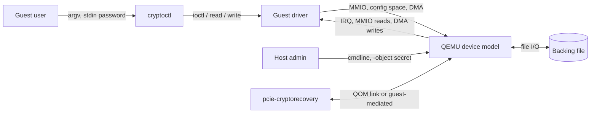
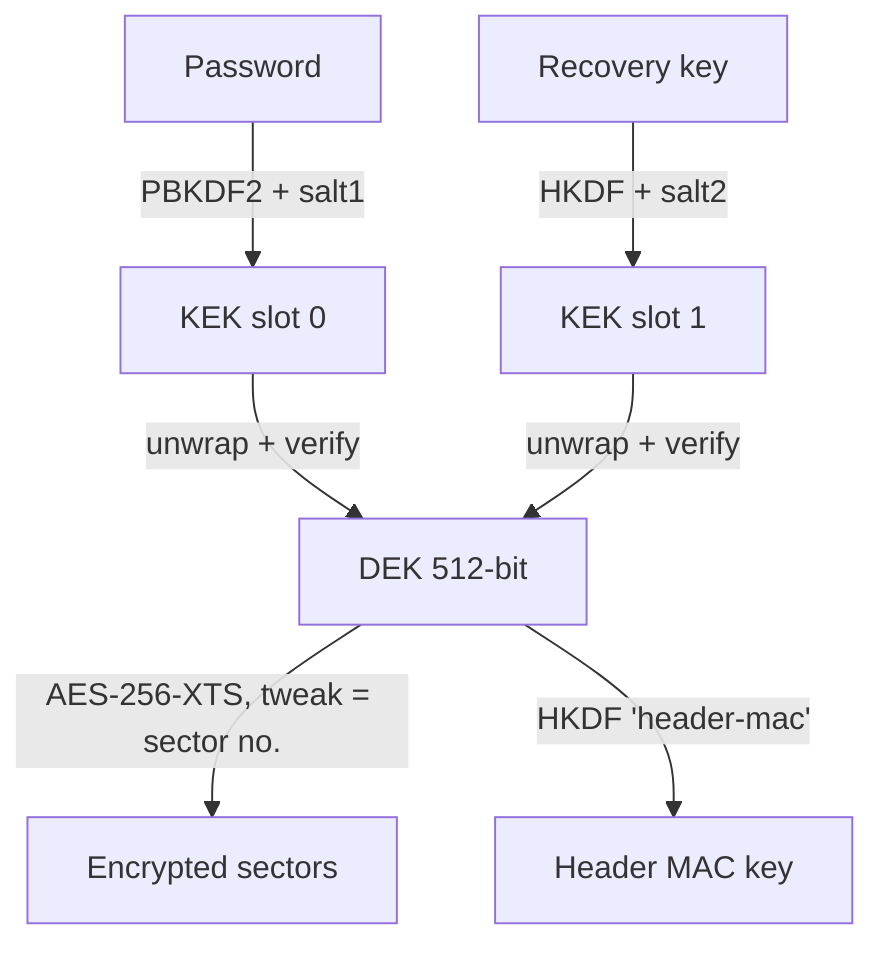
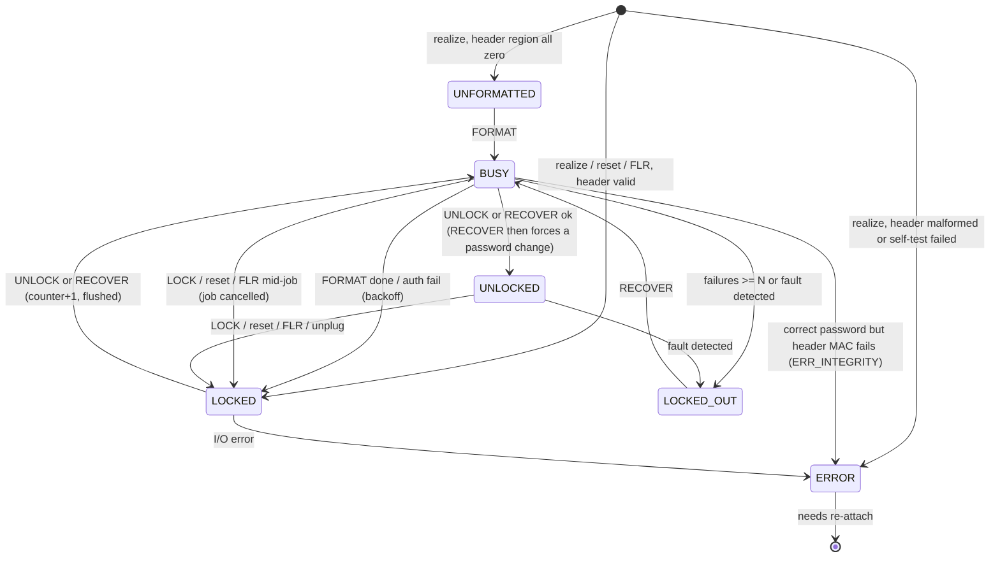

# Encrypted PCIe Storage Device — Threat Model & Attack Surface

Sep 26, 2026 · @Ved

## 1. Purpose, scope and system overview

This doc fixes what the encrypted storage device must defend, against whom, and what it deliberately does not defend. Every later artifact (datasheet, backing-file format, driver, CLI) must trace back to a requirement here.

The core security claim is one sentence:

> **An attacker who obtains the backing file, but not the password or recovery key, learns nothing about the stored data beyond its size, and cannot modify it undetectably (see SR-08 for how strong "undetectably" is).**

Everything else here either supports that claim or explicitly limits it.

### Components

| Component | Where it runs | Role |
| --- | --- | --- |
| `pcie-cryptostore` device model | QEMU process on the host | Holds the device state machine, enforces lock state, does the crypto, owns the in-memory DEK while unlocked |
| Backing file | Host filesystem | Header + keyslots + encrypted sectors. The only thing that exists "at rest" |
| Guest driver (`cryptostore.ko`) | Guest kernel | Talks to BAR0 and DMA, exposes a block device and a control char device |
| CLI (`cryptoctl`) | Guest userspace | Unlock, lock, change password, status, recover |
| `pcie-cryptorecovery` device (stretch) | QEMU process | Holds the recovery key in its own backing file and releases it to the storage device over a QOM link (Section 9). Present or absent at VM launch |
| Guest recovery driver (`cryptorecovery.ko`) (stretch) | Guest kernel | Exposes recovery-device presence and status, and the "arm recovery" command |
| TPM / sealing (stretch) | QEMU (`swtpm` or in-device) | Releases the DEK only when platform measurements match |

### Lifecycle states in scope

Powered off (only the backing file exists), UNFORMATTED (blank image), running and LOCKED, running and UNLOCKED, LOCKED\_OUT after too many failures, ERROR, reset, snapshot/migration (always refused, SR-12), and hot-unplug.

## 2. Assets

The asset list decides what the attacker is after. A threat that touches no asset here is out of scope by definition.

| ID | Asset | Where it lives | Confidentiality | Integrity | Availability |
| --- | --- | --- | --- | --- | --- |
| A1 | User data (plaintext sectors) | Guest page cache while unlocked; never plaintext on host disk | **Required** | Required (detect tampering, see SR-08) | Best effort |
| A2 | Data encryption key (DEK) | Device memory while UNLOCKED only; wrapped in keyslots on disk | **Critical**: DEK = all data, forever | Critical | Loss = data loss |
| A3 | Password | User's head; transits CLI → driver → BAR; never stored | **Critical** | n/a | n/a |
| A4 | Recovery key | `pcie-cryptorecovery` device / printed by user | **Critical** | Critical | Must survive password loss |
| A5 | Keyslot metadata (salt, KDF params, wrapped DEK, MAC) | Backing-file header | Public by design (not secret) | **Critical**: tampering can downgrade KDF or brick the device | Loss = data loss (consider header backup) |
| A6 | Failed-attempt counter / lockout state | Device state, persisted in header | Public | **Critical**: resetting it defeats rate limiting | Required |
| A7 | Lock state (LOCKED/UNLOCKED) | Device state machine | Public | **Critical**: "UNLOCKED" must never be forgeable | Required |

Two observations shape the rest of the design:

- The password (A3) is low-entropy. The DEK (A2) is high-entropy. The KDF and the lockout counter exist only to close that gap.
- A5 and A6 are **not secret but must not be tamperable**. Encryption alone does not give you this. You need a MAC over the header.

## 3. Actors and trust assumptions

The primary adversary is **offline**: someone holding a copy of the backing file. Online adversaries inside the guest are in scope only for the device's enforcement (lock state, rate limiting), not for secrecy of the password once typed.

| ID | Actor | Capabilities | Trusted? | In scope as attacker? |
| --- | --- | --- | --- | --- |
| T1 | Offline attacker | Has one or more copies of the backing file (stolen disk, backup, cloud snapshot). Unlimited compute and time | No | **Yes: primary** |
| T2 | Unprivileged guest user | Can open files per permissions, run programs, call `cryptoctl` if allowed | No | **Yes** |
| T3 | Guest root / malicious driver | Full control of the guest kernel: can issue arbitrary MMIO, DMA, config-space writes | Partially | **Yes, for device enforcement only.** It cannot learn the DEK or bypass lockout. It *can* sniff a password typed inside the guest |
| T4 | Legitimate user | Knows password and/or holds recovery key | Yes | No |
| T5 | Host administrator / host root | Controls QEMU, its memory, the command line, the backing file | **Yes (TCB)** | No, see Section 6 |
| T6 | Other VMs on the same host | Share the host kernel and CPU | n/a | No, host isolation problem |
| T7 | Active file tamperer | Can modify or roll back the backing file between runs (e.g. a malicious storage backend) | No | **Partially**: detect header tampering; sector-level rollback noted as a limitation |

### Trust boundaries

Each arrow is an attack surface. Anything crossing it is untrusted input to the receiver.

Key boundary rule: **the device model treats everything from the guest as hostile**, including register values, DMA descriptors and lengths. The driver must also not trust the device (defensive programming), but a malicious device is out of scope.

## 4. Attack surface enumeration

The attack surface is every place untrusted input enters a component, plus every place a secret could leave one. List them exhaustively first; decide scope afterwards (Sections 5 and 6).

| ID | Surface | Input from | Secrets that could leak through it | Scope |
| --- | --- | --- | --- | --- |
| S1 | BAR0 MMIO registers (command, status, password window, sector window) | T3 guest kernel | Password, DEK, stale buffers | In |
| S2 | DMA (descriptor ring, data buffers) when added | T3 | Plaintext, stale device buffers | In |
| S3 | PCI config space (BAR sizing, MSI setup, command register) | T3 | None expected | In (robustness) |
| S4 | Interrupts and timing (completion latency) | Device → guest | Password correctness via timing | In |
| S5 | Backing file contents | T1, T7 | Everything, if format is weak | **In: primary** |
| S6 | Backing file header parser | T7 (crafted file) | Crash or code execution in QEMU | In |
| S7 | QEMU command line and `-object secret` | T5 host | Initial password, recovery key | Out (host trusted) |
| S8 | Device reset (guest-triggered FLR, system reset) | T3 | DEK surviving reset | In |
| S9 | Snapshot / live migration stream | T5, storage of snapshots | DEK and plaintext in RAM image | In as a **policy decision** (Section 5) |
| S10 | Hot-unplug and driver unbind | T3 | Use-after-free in driver, DEK left resident | In |
| S11 | Char device / ioctl ABI (`/dev/cryptostore-ctlN`) | T2 | Password via bad copy, kernel memory disclosure | In |
| S12 | Block device (`/dev/cryptostoreN`) | T2 | Data while unlocked, via file permissions | In (permissions only) |
| S13 | CLI (`cryptoctl`) argv, env, terminal | T2, T4 | Password in shell history, `ps`, core dumps, swap | In |
| S14 | Guest kernel memory (driver buffers, page cache) | T3 | Password and plaintext | Out, noted in Section 6 |
| S15 | Recovery-device channel | T3 or device-to-device | Recovery key | In (stretch) |
| S16 | QEMU process memory | T5 | DEK while unlocked | Out, noted in Section 6 |
| S17 | Tracepoints, debug logs, error messages | Anyone reading logs | Password, key material | In |

S17 is easy to forget. The tracepoints from the hello-world device log every MMIO write, which would include the password. Those trace events must be removed or redacted for the password window.

## 5. Attack vectors and mitigations

Each vector names the surface, its STRIDE class (**S**poofing, **T**ampering, **R**epudiation, **I**nformation disclosure, **D**enial of service, **E**levation of privilege), the mitigation, and the requirement it creates.

### Offline attacks on the backing file (T1, T7)

| ID | Vector | Surface | STRIDE | Mitigation | Req |
| --- | --- | --- | --- | --- | --- |
| V1 | Brute-force the password offline against a keyslot | S5 | I | Slow KDF with per-slot random salt (PBKDF2-HMAC-SHA256 in v1; Argon2id later via the KDF ID, O10). The online lockout counter does **nothing** here; KDF cost is the only defense | SR-03 |
| V2 | Infer data patterns (identical sectors, zero regions) | S5 | I | Per-sector tweak (AES-XTS with the sector number). Never ECB, never a fixed IV | SR-06 |
| V3 | Downgrade the KDF by editing header parameters (e.g. iterations = 1), then brute-force | S5 | T | Device enforces minimum KDF parameters; header MAC keyed from the DEK | SR-07 |
| V4 | Swap wrapped DEK or keyslots between files | S5 | T, S | Authenticated key wrap (AES-KW or AEAD); bind slot to a device UUID in the header | SR-07 |
| V5 | Flip bits in ciphertext sectors to corrupt or steer plaintext | S5 | T | XTS gives no integrity. Either accept (documented) or add per-sector MACs | SR-08 (decision) |
| V6 | Roll back the whole file to an older copy | S5 | T | Undetectable without a trusted monotonic counter (TPM stretch). Documented limitation | SR-17 |
| V7 | Use an **old backup** with the **old password** after a password change | S5 | I | Changing the password re-wraps the same DEK, so old copies stay openable with the old password. Offer a separate `rekey` operation that re-encrypts under a new DEK | SR-18 |
| V8 | Craft a malicious header to crash or exploit QEMU's parser | S6 | E, D | Strict bounds-checked parsing, magic + version check, fuzzing | SR-16 |

### Online attacks through the device interface (T3)

| ID | Vector | Surface | STRIDE | Mitigation | Req |
| --- | --- | --- | --- | --- | --- |
| V9 | Read or write sectors while LOCKED | S1, S2 | I, T | All data commands return `ERR_LOCKED` and transfer nothing | SR-01 |
| V10 | Online password guessing at bus speed | S1 | S | Failure counter with exponential backoff and a LOCKED\_OUT state; counter incremented and persisted **before** checking | SR-04 |
| V11 | Reset the VM to clear the failure counter | S8 | S | Counter lives in the backing file, not RAM | SR-04 |
| V12 | Measure unlock latency to learn about the password | S4 | I | Constant-time MAC compare; KDF always runs to completion; fixed minimum response time | SR-05 |
| V13 | Read back the password window or a stale sector buffer | S1 | I | Password window is write-only (reads return 0); all windows zeroed after each command | SR-09 |
| V14 | Out-of-range sector number, oversize length, integer overflow | S1, S2 | E, D | Bounds-check every guest-supplied field with overflow-safe arithmetic | SR-10 |
| V15 | DMA descriptors pointing at the device's own BAR (re-entrancy) | S2 | E | Use `pci_dma_*` APIs and QEMU's memory re-entrancy guard | SR-11 |
| V16 | DEK survives a reset or driver unbind | S8, S10 | I | Zeroize DEK on LOCK, reset, unrealize and LOCKED\_OUT | SR-02 |
| V17 | Deliberately exhaust attempts to lock out the legitimate user | S1 | D | Accepted. Recovery path exists. Backoff rather than permanent brick | SR-04 |

### Lifecycle and host-side (T5 outcomes)

| ID | Vector | Surface | STRIDE | Mitigation | Req |
| --- | --- | --- | --- | --- | --- |
| V18 | Snapshot or migrate while UNLOCKED, capturing the DEK in the image | S9 | I | Both devices are unmigratable: migration and snapshots are refused in every state | SR-12 |
| V19 | Password or key visible in tracepoints and logs | S17 | I | No secret material in traces; redact password-window writes | SR-15 |

### Guest-side software (T2, T3)

| ID | Vector | Surface | STRIDE | Mitigation | Req |
| --- | --- | --- | --- | --- | --- |
| V20 | Password in argv, shell history, `ps`, swap or core dumps | S13 | I | Read from TTY with echo off (or stdin), `mlock`, disable core dumps, `explicit_bzero` after use | SR-13 |
| V21 | Kernel stack/heap leak through ioctl structs | S11 | I | Zero-initialize structs; `memzero_explicit` password buffers | SR-14 |
| V22 | Unprivileged user unlocks, locks or reads the device | S11, S12 | E | Control node root-only (or a `cryptostore` group); block node follows normal disk permissions | SR-19 |
| V23 | Guest root reads the recovery key in a guest-mediated recovery flow | S15 | I | Design decision: device-to-device link keeps the key out of the guest | SR-20 (decision) |

## 6. Out of scope

These are deliberate exclusions, not oversights. Each one says why it is excluded and what would bring it into scope.

| ID | Excluded threat | Why | What would bring it in scope |
| --- | --- | --- | --- |
| O1 | Malicious host / host root reading QEMU memory while UNLOCKED | The device model *is* host software; nothing in it can hide from its own process owner | Confidential computing (SEV-SNP, TDX), or a real hardware device |
| O2 | Host admin reading the password or recovery key off the QEMU command line | Provisioning is a host-trusted step | Provision secrets in-guest only; never on the command line |
| O3 | Guest root sniffing the password as it is typed or passes through the driver | A compromised guest kernel sees all guest input. Real self-encrypting drives have the same limit | Trusted input path (e.g. unlock in firmware/pre-boot) or TPM sealing (Section 9) |
| O4 | Plaintext in guest page cache, swap or guest RAM while UNLOCKED | Encryption at rest protects **rest**, not use | Guest-side memory encryption; lock + drop caches policy |
| O5 | Physical and microarchitectural side channels (cache timing, Spectre-class, power) | Belongs to the host/CPU, not a QEMU device | Out of reach for an emulated device |
| O6 | Sector-level rollback and replay of individual ciphertext blocks | Needs a Merkle tree or trusted counter; large complexity for a first version | Integrity tree over sectors, anchored in the TPM counter |
| O7 | Denial of service by deleting or corrupting the backing file | Availability of host storage is the host's job | Header backups, redundancy |
| O8 | Malicious or buggy device attacking the guest driver | We control both sides; the driver is defensive but not hardened | IOMMU + a hardened driver, if the device were third-party |
| O9 | Weak user-chosen passwords | Policy, not mechanism. The KDF raises cost but cannot save `password123` | Minimum-entropy check in `cryptoctl` (easy to add) |
| O10 | Cryptographic primitive breaks (AES, SHA-2, Argon2) | Use vetted libraries; don't invent crypto | Crypto agility: cipher/KDF IDs in the header |

The most important line to be honest about is **O3**: once the guest is compromised, the password is exposed at the moment of unlock. The device still guarantees that a compromised guest cannot recover the key from a *locked* device, and cannot bypass the rate limit.

O5 is revisited for one theoretical extension: Section 10 brings physical fault injection into scope as if the device were real silicon, and tests the countermeasures with simulated faults.

## 7. Security requirements

These 20 requirements are the contract. The datasheet, backing-file format and code reviews check against this list. Each is testable.

| ID | Requirement | Traces to | Verified by |
| --- | --- | --- | --- |
| SR-01 | In LOCKED or LOCKED\_OUT, every data command fails with `ERR_LOCKED` and transfers zero bytes | V9 | qtest |
| SR-02 | The DEK is zeroized on LOCK, reset, unrealize and entry to LOCKED\_OUT | V16 | qtest + code review |
| SR-03 | Keyslot KEKs are derived with a slow KDF (PBKDF2-HMAC-SHA256 calibrated in v1; Argon2id preferred later) and a 32-byte random salt per slot; unlock cost ≥ \~0.5 s on the dev machine | V1 | Benchmark |
| SR-04 | Failed attempts are counted in the backing file, incremented and flushed **before** verification; backoff doubles per failure; LOCKED\_OUT after N = 10 (policy and rationale in 11.10) | V10, V11, V17 | qtest incl. reset between attempts |
| SR-05 | Password verification uses a constant-time compare; response time does not depend on password correctness. Responses are padded to 1 s (to the next whole second if KDF plus jitter exceeds that); the `ERR_BACKOFF` path may return immediately | V12 | Timing test over 1,000 attempts |
| SR-06 | Data sectors are encrypted with AES-256-XTS, tweak = sector number | V2 | Known-answer test; identical plaintext sectors → different ciphertext |
| SR-07 | The header is authenticated; KDF parameters below the minimum are rejected; keyslots are bound to the device UUID | V3, V4 | Tamper tests on the file |
| SR-08 | Decision: v1 accepts that sector tampering yields garbage, not detection (documented) | V5 | Doc |
| SR-09 | The password window is write-only; all data/password windows are zeroed after each command completes | V13 | qtest |
| SR-10 | Every guest-supplied offset, length and sector number is bounds-checked with overflow-safe arithmetic | V14 | qtest + fuzzing |
| SR-11 | All DMA goes through `pci_dma_*`; device MMIO re-entrancy is guarded | V15 | Code review + qtest |
| SR-12 | Both devices refuse migration and snapshots in all states (a vmsd marked unmigratable, or a permanent migration blocker; having no vmsd is not enough, since that silently loses state instead of blocking) | V18 | Manual test with `savevm` / `migrate` |
| SR-13 | `cryptoctl` never takes secrets in argv; reads with echo off; locks memory; wipes buffers; disables core dumps | V20 | Code review + `ps` / `strings` check |
| SR-14 | Driver ioctl structs are zero-initialized; password buffers wiped with `memzero_explicit` | V21 | Code review |
| SR-15 | No secret material appears in tracepoints, logs or error messages | V19 | grep trace output after tests |
| SR-16 | The header parser rejects any malformed file without crashing | V8 | Fuzzing the parser in isolation |
| SR-17 | Whole-file rollback is documented as undetected in v1 | V6 | Doc |
| SR-18 | `cryptoctl` offers `rekey` (new DEK, full re-encrypt) separate from `passwd`, and documents the difference | V7 | Manual test |
| SR-19 | Control device is root/group-only; block device follows standard disk permissions | V22 | Manual test as unprivileged user |
| SR-20 | Decision: recovery key flow is device-to-device (key never enters guest) **or** guest-mediated (documented exposure) | V23 | Doc + recovery test |

## 8. Crypto design implied by the threat model

Use a LUKS-style two-level key hierarchy: one random DEK encrypts the data; each password or recovery key only wraps the DEK. This makes password change cheap (V7 aside) and makes the recovery key just another keyslot.

### Algorithm choices

| Purpose | Choice | Why | QEMU API |
| --- | --- | --- | --- |
| Data encryption | AES-256-XTS, 512-byte sectors, tweak = sector number | Standard for disk encryption; no per-sector storage overhead | `qcrypto_cipher_*` with `QCRYPTO_CIPHER_MODE_XTS` |
| Password → KEK | PBKDF2-HMAC-SHA256, iterations calibrated to \~0.5 s, stored per slot | Available in QEMU today; Argon2id is stronger against GPUs but needs an external library | `qcrypto_pbkdf2`, `qcrypto_pbkdf2_count_iters` |
| Recovery key → KEK | HKDF-SHA256 (recovery key is already 256 bits of randomness, no slow KDF needed) | High-entropy input does not need stretching | HMAC via `qcrypto_hmac_*` |
| Keyslot wrap | KEK → (enc key, MAC key); wrapped = AES-256-CTR(DEK) with a random 16-byte IV stored in the slot; tag = HMAC-SHA256 over UUID, slot ID, KDF params, salt, IV, wrapped DEK | Authenticated wrap: wrong password and tampered slot both fail the tag check | `qcrypto_cipher_*`, `qcrypto_hmac_*` |
| Password check | Constant-time comparison of the tag | Satisfies SR-05 | Hand-written constant-time compare |
| Randomness | DEK, salts, UUID, recovery key | Must be a CSPRNG | `qcrypto_random_bytes` |

### Backing-file layout (v1)

| Offset | Size | Field | Authenticated by |
| --- | --- | --- | --- |
| 0x0000 | 8 B | Magic `CRYPTOST` | Header MAC |
| 0x0008 | 4 B | Format version | Header MAC |
| 0x000C | 16 B | Device UUID | Header MAC + each slot tag |
| 0x001C | 8 B | Data capacity (sectors) | Header MAC |
| 0x0024 | 4 B | Cipher ID, KDF ID | Header MAC |
| 0x0100 | 8 × 256 B | Keyslots: state, KDF params, salt, wrapped DEK, tag | Per-slot HMAC tag |
| 0x0900 | 32 B | Header MAC (HMAC-SHA256, key from DEK) | n/a |
| 0x0F00 | 16 B | Failure counter + last-failure timestamp | **Not** MAC'd (see below) |
| 0x1000 | capacity × 512 B | Encrypted data | XTS only (SR-08) |

### A subtle point: the failure counter cannot be MAC'd with the DEK

The counter changes while the device is LOCKED, when no DEK is available. So it cannot sit under the DEK-keyed header MAC.

This is acceptable. The counter defends against the online guest (T3), who cannot edit the file. An offline attacker (T1) ignores the counter anyway and attacks the KDF directly. A trusted monotonic counter (TPM stretch) is what would close the host-side gap.

**Administrative reset (T5 capability).** `tools/cryptostore_image.py` can clear the failure counter in the image of a stopped VM. This is how a test image bricked by LOCKED\_OUT (for example after a false-positive fault detection) is recovered before the recovery device exists. It adds no live interface: only the host administrator, who is trusted (T5), can edit the file.

## 9. Extensions: recovery device and TPM

Both extensions add a new surface and a new asset. Each needs its own row in Sections 4, 5 and 7 before it is built.

### Recovery device

The recovery key is a second keyslot (slot 1), so the storage device needs no new crypto. The design question is only **how the recovery secret reaches the storage device**.

| Option | How it works | Recovery key visible to guest? | New surfaces | Cost |
| --- | --- | --- | --- | --- |
| A. Guest-mediated | Driver reads key from `pcie-cryptorecovery` BAR, writes it into the storage device's password window | Yes, guest root sees it (V23) | Recovery BAR, driver copy path | Simple; two independent devices |
| B. Device-to-device (recommended) | Storage device has a QOM `link` property to `pcie-cryptorecovery`; guest just issues `RECOVER` | No, stays inside QEMU | QOM link, `RECOVER` command, recovery device access control | Slightly more QEMU work; mirrors a real secure element |

Whichever option is chosen, the recovery device must:

- Only release the key once per boot, or only after a physical-presence-like host event.
- Be **absent-safe**: without the device, `RECOVER` returns `ERR_NO_RECOVERY` and the CAPS register reports no recovery capability.
- Rate-limit `RECOVER` like unlock (it shares SR-04's counter).
- Force a password change after a successful recovery.

The demo requirement (show the system with and without the recovery device) becomes two test configurations: `-device pcie-cryptorecovery,…` present, and absent.

**Decision: Option B (device-to-device).**

- The recovery key never enters the guest. `pcie-cryptostore` has a QOM link property to `pcie-cryptorecovery` and asks it for the key directly.
- `pcie-cryptorecovery` has its **own drive** (persistent storage) holding the recovery key, and enforces release-once-per-boot (F8).
- `FORMAT` generates the recovery key inside the storage device and delivers it over the link. If the recovery device is absent at `FORMAT`, no recovery slot is created. `ENROLL_RECOVERY` (UNLOCKED only) adds one later.
- The guest still gets a real recovery driver and tool: `cryptorecovery.ko` exposes presence and status and an "arm recovery" command, so recovery needs an explicit guest action. `cryptoctl recover` drives the flow: arm → `RECOVER` on the storage device → forced password change.
- Without the recovery device, `RECOVER` returns `ERR_NO_RECOVERY` and the CAPS register reports no recovery capability. The final demo shows both configurations.
- **Trade-off:** the user cannot make a paper copy of the recovery key from inside the guest.

### TPM-like module

A TPM adds three capabilities that directly close gaps listed above:

| TPM capability | Closes | How |
| --- | --- | --- |
| Sealing to measurements (PCRs) | O3 partly: unlock without typing a password inside a possibly-compromised guest | DEK wrap key is released only when PCRs match the values at seal time |
| Trusted monotonic counter | V6 and O6: rollback | Store the counter value in the header; refuse to unlock if header counter < TPM counter |
| Hardware anti-hammering | V10 host-side gap | Failure counting moves into the TPM, which the host storage cannot roll back |

Two ways to build it:

1. **Reuse QEMU's TPM (chosen).** Attach `tpm-crb` backed by `swtpm`. The guest seals a keyslot secret with TPM2 commands (as `systemd-cryptenroll --tpm2` does for LUKS). The storage device stays unchanged; the TPM is just another keyslot provider. This is the realistic, lower-effort path.
2. **Embed a mini-TPM in the device.** Add measurement registers (extend-only: `new = SHA256(old || value)`), `SEAL` / `UNSEAL` commands and a monotonic counter persisted in a separate host-side state file. This is more work but lets the device enforce policy itself.

The trap with either: **who extends the PCRs?** If guest root can extend them to any value, it can replay the expected measurements. Measurements are only meaningful when an earlier, trusted boot stage records them before an attacker can run. Extend-only semantics stop a later stage from resetting them, but not from lying at the start.

## 10. Physical fault-injection hardening (theoretical extension)

This section deliberately goes beyond the base threat model. It asks: **if this device were real silicon, or firmware on a secure controller, how would it survive an attacker who can glitch it?** In the QEMU build, these countermeasures are designed, implemented and tested with *simulated* faults. They are not claimed as real protection, because anyone with host access can simply read QEMU's memory (O1).

### Attacker model (T8)

| Property | T8: physical fault attacker |
| --- | --- |
| Access | Physical possession of the machine holding the device and backing store |
| Capability | Induces transient faults at chosen times: voltage or clock glitches, EM or laser pulses |
| Fault effects | Skip one or a few instructions; corrupt a register or a loaded value; corrupt a branch decision |
| Timing | Synchronizes on observable events (the MMIO command arriving, bus activity, power trace) |
| Cannot | Read the controller's internal memory directly (the secure-element assumption) |
| Goal | Get data without the password, remove the guessing limit, or extract the DEK |

This revises O5 ("physical side channels out of reach") for this extension only. Microarchitectural side channels on the host stay out of scope.

### Design principle: let the keys do the protecting, not the branches

The key hierarchy already makes many glitches useless. **Skipping the password check doesn't help**: a wrong password gives a wrong KEK, which unwraps a garbage DEK, which decrypts garbage. **Skipping the lock-state check doesn't help either**, *provided* the DEK really is gone while LOCKED.

So the design rule is: security should come from **the absence of a key** wherever possible, and from a branch only where it can't. That narrows FI hardening to a short list of targets.

### What a glitch could actually win

| ID | Target | Glitch effect | Why it matters | Countermeasure |
| --- | --- | --- | --- | --- |
| F1 | Failure-counter increment + flush | Skip it | Unlimited guesses through the device | Verify-after-write; redundant check that the counter advanced before running the KDF |
| F2 | Backoff / LOCKED\_OUT check | Force "allowed" | Removes rate limiting | Redundant, jittered check; fail-secure encoding of the result |
| F3 | DEK zeroization on lock / reset / FLR | Skip the wipe | DEK stays resident, so a later skipped lock check *does* return plaintext | Wipe, then verify the buffer reads back as zero; redundant lock-state check on the data path as a second line |
| F4 | Lock-state check on read/write commands | Force "unlocked" | Only matters if F3 also succeeded | Redundant check at command entry *and* before returning data |
| F5 | KDF minimum-parameters check | Force "ok" | Enables a KDF downgrade (V3) | Redundant check |
| F6 | Bounds checks on sector number / length | Skip | Memory corruption inside the device | Redundant check; checks placed immediately before each access |
| F7 | AES computation while UNLOCKED | Corrupt an intermediate round | Differential fault analysis can recover the key from a few faulty outputs | Compute twice (or encrypt then decrypt-and-compare) before releasing any output; suppress output on mismatch |
| F8 | Recovery device "release once" check | Skip | Recovery key released repeatedly | Redundant check; counter in the recovery device |
| F9 | Tag compare | Force "match" | Low value (garbage DEK), but header MAC then fails; still harden for defense in depth | Double compare with different code paths |

### Countermeasure patterns

- **Random timing jitter before critical checks.** Insert a random delay between the event the attacker triggers on (the MMIO command) and the check itself. The attacker can no longer hit the check with one fixed-offset glitch. The delay value must come from the CSPRNG; a predictable delay adds nothing.
- **Redundant verification.** Evaluate each critical decision at least twice, preferably by different code paths, and re-check immediately before the sensitive action. A single skipped instruction then can't flip the outcome. Two identical computations can be faulted identically, so vary them.
- **Fail-secure encodings.** Represent booleans that matter (auth result, lock state) with multi-bit constants far apart in Hamming distance, not 0 and 1, and make the default state LOCKED. A corrupted value then decodes as "invalid", which is treated as failure.
- **Control-flow integrity counter.** Each step of the unlock sequence advances a step counter; the final state change checks the counter equals the expected total. A skipped step shows up as a wrong count.
- **Verify-after-write.** Read back the failure counter, slot writes and zeroized buffers, and compare.
- **Detection response.** On any detected fault: zeroize everything, enter LOCKED\_OUT, count it as a failed attempt, and emit a non-secret event. Never reveal which check tripped.
- **Keep the compiler honest.** Optimizers happily merge or delete "redundant" checks. Use volatile accesses and compiler barriers, then **confirm in the disassembly** that every redundant check survived.

### Reference: `secure_jitter` (prior work, Rust)

The author's existing `secure_jitter` macro (ECE397-MP2, Pattern 10) is the reference implementation for the jitter + redundancy pattern. It will be ported to C for the device model. Its structure:

1. Launder the delay value through an optimization barrier so the compiler can't treat it as a constant.
2. Keep two volatile copies of the delay value for cross-checking.
3. Run a volatile countdown loop with a `nop` barrier each iteration, so the loop can't be fused or removed.
4. After the loop, run three redundant checks: the counter is exactly zero, the saved copy still equals the original, and a re-read of the counter is still zero. Any mismatch is treated as a detected fault.
5. The accompanying assembly analysis confirms each volatile access and each check survives compilation.

What changes when porting it here: the delay must be seeded from the device's CSPRNG per call; the panic becomes the detection response above (zeroize + LOCKED\_OUT) instead of halting; and the pattern is placed after the command trigger and before each F-target check. In an emulated device, the delay is in host CPU time, so it models the defense rather than providing it.

### Requirements added

| ID | Requirement | Traces to |
| --- | --- | --- |
| SR-21 | Security-relevant states and results use fail-secure multi-bit encodings; default state is LOCKED; UNLOCKED is entered only after positive confirmation | F2, F4, F9 |
| SR-22 | Every F-target decision is evaluated redundantly by differing code paths and re-checked immediately before the protected action | F1–F9 |
| SR-23 | A CSPRNG-seeded jitter delay (`secure_jitter` pattern) precedes each control-plane F-target check (F1, F2, F3, F5, F8, F9), which run once per unlock or lock. Data-path targets (F4, F6, F7) use redundancy without jitter to keep I/O latency reasonable; SR-26's double computation still applies to F7 | F1–F9 |
| SR-24 | The unlock sequence carries a control-flow step counter verified before entering UNLOCKED | F1, F2, F5, F9 |
| SR-25 | Counter, slot writes and zeroized key buffers are verified after writing | F1, F3 |
| SR-26 | AES output is released only after a consistency check (double computation or round-trip) | F7 |
| SR-27 | Any detected fault zeroizes keys, enters LOCKED\_OUT, counts as a failure, and reveals nothing about which check fired | All |
| SR-28 | Disassembly of release builds is reviewed to confirm redundant checks and barriers survive optimization | All |
| SR-29 | FI hardening is validated by simulated fault injection (Section 12); fault hooks exist only in test builds | All |

## 11. Design review: gaps closed

A review pass found nine things the earlier sections implied but didn't pin down. Each is now a decision or requirement.

### 11.1 The device is a reference monitor

The device is the **only** reader and writer of the backing file. Every access is mediated by it (complete mediation), the guest can't alter its logic (tamperproof), and its interface is kept small enough to review (verifiable).

- **SR-30:** The backing image is attached only as the device's `drive`. It is never also attached to the guest (e.g. as a virtio disk) and never placed in a directory shared into the guest. QEMU image locking stays enabled.
- In the dev setup, images live in `~/cryptostore-images/`, outside the repository, and the 9p share into the guest is narrowed to `driver/`, `tools/` and `include/`, so the guest sees neither the images nor QEMU's build tree.

### 11.2 PCIe-specific surfaces

The device is a PCIe endpoint on `q35`, behind a `pcie-root-port`. That adds surfaces missing from Section 4:

| Surface | Decision |
| --- | --- |
| Function Level Reset | A guest-triggered reset path. Runs the same lock/zeroize path as SR-02, and cancels in-flight I/O first |
| Extended config space, AER | AER and error reporting carry no secret material (SR-15) |
| MSI-X table (own BAR) | Handled by QEMU core; note only |
| Hotplug via root port | Surprise removal while UNLOCKED leaves the device LOCKED when re-plugged |
| ATS, PASID, SR-IOV, peer-to-peer | Not implemented, which shrinks the surface. Listed as out of scope |

Recovery Option B uses a QOM link inside QEMU, not PCIe peer-to-peer. The design makes no claim about real P2P security.

### 11.3 Explicit state machine

Every command and every reset path must have a defined outcome in every state. Anything undefined returns an error and changes nothing.

- **UNFORMATTED** means the header region is entirely zero. Anything else that fails parsing is ERROR; a corrupt header is never treated as blank. `FORMAT` is allowed only in UNFORMATTED, which also stops guest root wiping a formatted image.
- **BUSY** covers a command in progress (FORMAT, the KDF job of UNLOCK / RECOVER / PASSWD, data I/O). Only LOCK, reset, FLR and unplug act on a BUSY device.
- Error codes introduced by the design decisions: `ERR_INTEGRITY` (the header MAC failed after a correct password, B5 in 11.4), `ERR_BACKOFF` (carries the seconds remaining, 11.10) and `ERR_NO_RECOVERY` (Section 9).

- **SR-31:** The datasheet lists, for every command, its result in each of UNFORMATTED, LOCKED, UNLOCKED, LOCKED\_OUT, ERROR and BUSY.

### 11.4 Crypto construction details

Pinned down from Section 8:

- PBKDF2 outputs **32 bytes**, which HKDF then expands into the wrap key and tag key. Requesting 64 bytes from PBKDF2 would let an attacker test guesses at half the cost.
- Every wrap uses a **fresh salt**, including re-wraps with the same password.
- The tag is verified **before** anything is decrypted.
- All authentication failures return one generic `ERR_AUTH`, never which check failed.
- Before unlock, only fields covered by the slot tag are trusted (UUID, slot index and type, KDF ID and parameters, salt, IV, wrapped DEK). Cipher ID and capacity are parsed but not relied on until the header MAC verifies.
- If a slot tag verifies but the header MAC then fails (correct password, tampered header): reset the failure counter (the tag proved the password, and the counter was already incremented under SR-04), zeroize, enter ERROR, return a **distinct `ERR_INTEGRITY`**, and emit a non-secret host log event. This branch is reachable only with the correct password, so it is no oracle for a guesser, and the real user needs to know the image was tampered with.
- HKDF labels are prefixed `cryptostore v1 ` for domain separation.

### 11.5 Crash consistency

A power cut at any point must leave at least one working keyslot and a correct failure count.

- **SR-32:** Password change writes the new slot into a free index, flushes, verifies it, then retires the old slot and updates the header MAC. Never rewrite the only working slot in place.
- The failure counter is flushed before verification (already SR-04).
- Rekey (v2) needs a persisted progress marker before it can be crash-safe.

### 11.6 Concurrency and ordering

- v1 runs one command at a time (BUSY bit, driver mutex).
- **SR-33:** LOCK, reset and FLR complete or cancel all in-flight I/O **before** zeroizing the DEK. No I/O completes after the key is gone, and no plaintext stays in a buffer.
- The KDF runs in a worker thread, because a ~0.5 s computation under QEMU's global lock would freeze the whole VM. Rules for the worker:
    - It does pure computation only: no device state, no block-layer I/O, no interrupts.
    - The failure counter is incremented and flushed in the device's normal context before the job is dispatched.
    - Completion returns to the main loop (a bottom half), which updates state and raises the interrupt.
    - LOCK, reset or FLR mid-job: mark the job cancelled, wipe the device's password copy immediately, and discard the result on return. The worker wipes its own buffers before exiting.

### 11.7 Provisioning

**Decision:** a guest `FORMAT` command on a blank image. The password never appears on the host command line, the DEK is generated inside the device, and no host tool needs its own crypto implementation.

- `FORMAT` is allowed only in UNFORMATTED (header region entirely zero, 11.3).
- `FORMAT` also fills the data area with random bytes (11.9) and, when the recovery device is present, generates and delivers the recovery key (Section 9).

### 11.8 Crypto self-tests

- **SR-34:** At realize, the device runs known-answer tests for AES-256-XTS, HMAC-SHA256, HKDF and PBKDF2. On failure it enters ERROR and refuses to attach. This catches a broken crypto library or build before it can silently write bad ciphertext.
- Vector sources: IEEE 1619 XTS-AES-256 vectors (512-bit keys); RFC 4231 for HMAC-SHA256; RFC 5869 test cases 1–3 for HKDF-SHA256; RFC 7914 §11 for PBKDF2-HMAC-SHA256 (RFC 6070 is SHA-1 only). Reuse vectors from QEMU's `tests/unit/` crypto tests where they fit.

### 11.9 Metadata leakage

The header is readable by anyone with the file. It reveals capacity, algorithm IDs, KDF cost, and which slots are active, so an attacker can tell whether a recovery key exists. This is accepted and documented; it doesn't weaken confidentiality of the data.

**Random fill at FORMAT.** `FORMAT` fills the whole data area with CSPRNG output.

- **Why:** without the fill, never-written sectors stay zero while written sectors look random. Anyone with the file could then see which sectors were ever used, which reveals how much data exists and hints at the filesystem layout. With the fill, the whole data area is indistinguishable from random.
- **Cost:** one pass over the image at FORMAT (quick at 64 MiB), and the image is no longer sparse.
- **Consequence:** never-written sectors decrypt to garbage, not zeros. The device does not claim zeroed-on-format semantics (mkfs doesn't need them).
- **Remaining leak:** comparing two copies of the file taken at different times still shows which sectors changed, because XTS is deterministic per sector.

### 11.10 Lockout policy

- The first 3 failures are free. After that, the backoff doubles from 1 s, with a 5-minute cap. LOCKED\_OUT at **N = 10**.
- Timestamps use the host wall clock (`QEMU_CLOCK_HOST`), and a successful unlock resets the counter.
- An attempt rejected with `ERR_BACKOFF` doesn't run the KDF and doesn't increment the counter.

Why these numbers are reasonable:

- **3 free tries** absorb honest mistakes (typos, caps lock) with no friction for the real user.
- **Doubling backoff** barely affects a human, who retries a few times, but makes scripted guessing through the device pointless.
- **N = 10** means an online attacker gets 10 guesses, total, ever, before recovery is required. Against any reasonable password that is effectively zero chance. It is the same scale as well-known designs, such as phones offering erase after 10 failed passcodes, or TPM dictionary-attack lockout.
- **The cap never triggers** at N = 10: the last delay is 64 s. It only matters if N is ever raised, so it is a safety bound.
- **The host wall clock** means pausing or resetting the VM doesn't skip a wait.
- **Rejected attempts don't count,** so an impatient user retrying during a wait can't lock themselves out.
- **The offline defense is the KDF, not this.** Lockout only stops guessing through the device.

## 12. Validation checkpoints

Validation happens at four points: before coding, at the end of each milestone, continuously on every change, and at runtime inside the device. No milestone is "done" until its gate passes.

### 12.1 Before coding

- [ ] Every vector (V1–V23, F1–F9) maps to at least one requirement, and every requirement maps to at least one test.
- [ ] Every surface in Section 4 and 11.2 is either covered by a requirement or listed as out of scope.
- [ ] The datasheet gives every register its access type, reset value, and behavior in each state (SR-31).
- [ ] The backing-file format lists its validation order (magic → version → reserved-zero → capacity vs file size → slot parameters).
- [ ] Open questions in Section 13 are answered or explicitly deferred.

### 12.2 Milestone gates

| Milestone | Gate: must be shown before moving on |
| --- | --- |
| M0 Hello-world PCIe device | Enumerates as a PCIe endpoint with MSI-X and FLR; FLR clears state; two instances work; trace output shows register accesses |
| M1 Backing file + format | Header written and re-parsed; malformed headers rejected without a crash; image cannot be opened twice (image locking); crypto self-tests pass at realize (SR-34) |
| M2 Lock / unlock | Wrong password counted across a VM reset; backoff and LOCKED\_OUT work; `ERR_AUTH` identical for every failure; timing test passes; DEK zeroed after LOCK, reset and FLR |
| M3 Data path + block device | Data commands refused while LOCKED; known plaintext never found in the backing file; identical sectors encrypt differently; bounds checks reject out-of-range sectors; `mkfs` + `mount` work while UNLOCKED |
| M4 Password change + crash safety | Power cut simulated at every step of the change leaves a working slot (SR-32); fresh salt on every wrap |
| M5 Recovery device | Works with the device present; `ERR_NO_RECOVERY` without it; forced password change after recovery; hot-plug/unplug behaves per 11.2 |
| M6 FI hardening | Simulated faults on each F-target are detected and trigger SR-27; disassembly review shows redundant checks survive (SR-28) |
| M7 TPM (stretch) | Sealed slot only opens when measurements match; rollback detected via the monotonic counter |

### 12.3 On every change

- The qtest suite for the device passes.
- The header parser is fuzzed for a fixed time budget.
- Trace and log output from the full test run is searched for the test password and key bytes; any hit fails the build (SR-15).
- Release-build disassembly of the F-target functions is diffed against the last reviewed version (SR-28).

### 12.4 Simulated fault injection (for M6)

Real glitching isn't possible against an emulated device, so faults are simulated. Three complementary approaches, from cheapest to most realistic:

1. **Fault hooks in test builds.** Compile-time hooks let a test force a chosen check to return the wrong result, skip a counter write, or skip a wipe. Each F-target gets one hook. Hooks are compiled out of normal builds (SR-29).
2. **Debugger-driven faults.** Break at a check in the running QEMU process, alter the register or skip the branch, continue, and confirm detection.
3. **Instruction-skip campaigns.** Run the security-critical functions in isolation under an emulator that skips or corrupts one instruction at a time across the whole function. Every run must end either in correct behavior or in detected-fault behavior, never in a silent wrong result.

### 12.5 Runtime checks inside the device

- At realize: crypto known-answer tests (SR-34) and full header validation.
- Before unlock: KDF-parameter minimums, backoff state, counter persisted and read back (SR-04, SR-25).
- During unlock: control-flow step counter (SR-24).
- On every data command: lock state checked redundantly, bounds checked (SR-22, SR-10).
- On lock, reset and FLR: in-flight I/O drained, then keys wiped and verified zero (SR-33, SR-25).
- On any detected inconsistency: fault response (SR-27).

## 13. Security test plan and open questions

Tests run at three layers, cheapest first. Most requirements are provable at the qtest layer with no guest OS at all.

| Layer | Tool | Covers |
| --- | --- | --- |
| Device model, no guest | QEMU `qtest` driving BAR0 directly | SR-01, 02, 04, 05, 09, 10, 11 |
| File format, offline | Python script that reads/edits the backing file; `strings`/entropy checks; fuzzing the header parser | SR-03, 06, 07, 16 |
| Full system | Guest with driver + `cryptoctl`; savevm/migrate; unprivileged user | SR-12, 13, 14, 15, 18, 19, 20 |

### Negative tests worth writing first

- [ ] Read a sector while LOCKED → `ERR_LOCKED`, window stays zero.
- [ ] Wrong password N times, reset the VM, try again → still counted.
- [ ] Unlock, write known text, lock, `grep` the backing file for that text → not found.
- [ ] Two identical plaintext sectors → different ciphertext.
- [ ] Edit KDF iterations in the header → unlock refused.
- [ ] Change password, restore an old backup, old password → **works** (demonstrates V7; `rekey` is the fix).
- [ ] `savevm` or `migrate` in any state → refused (SR-12).
- [ ] Run the full suite with tracing on, then `grep` trace output for the password → not found.
- [ ] Boot without `pcie-cryptorecovery`, issue `RECOVER` → `ERR_NO_RECOVERY`.

### Open questions

All answered:

- [x] Recovery key flow: **Option B, device-to-device** (Section 9).
- [x] Lockout policy: **backoff after 3 free failures, LOCKED\_OUT at N = 10** (11.10).
- [x] Sector integrity: **XTS-only for v1** (SR-08).
- [x] Data path: **MMIO sector window for v1**; DMA as its own milestone after M4.
- [x] Provisioning: **guest `FORMAT` on a blank image** (11.7).
- [x] TPM route: **`swtpm` + `tpm-crb` keyslot provider** (Section 9), deferred to M7.
- [x] Fault response: **straight to LOCKED\_OUT** (SR-27); the offline counter reset (Section 8) covers test images bricked by false positives.
- [x] FI placement: **jitter before control-plane checks only** (SR-23).
